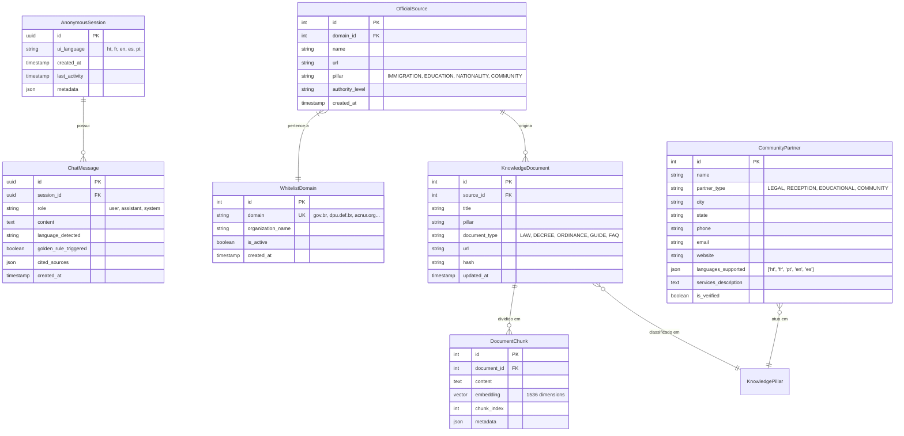

# Data Model: Chat de Orientação e Consulta Multilíngue (Quatro Pilares)

**Feature**: `001-multilingual-migrant-chat` | **Date**: 2026-09-05

## Diagrama Entidade-Relacionamento

## Descrição das Entidades

### 1. `AnonymousSession` (`apps/chat/models.py`)
- **Propósito**: Representa a sessão de interação temporária do usuário migrante.
- **Campos**:
  - `id` (UUIDField, primary_key): Identificador único da sessão gerado pelo cliente ou backend.
  - `ui_language` (CharField, max_length=10, default='pt'): Idioma atual selecionado para a interface (`ht`, `fr`, `en`, `es`, `pt`).
  - `created_at` (DateTimeField, auto_now_add=True): Data/hora de início da sessão.
  - `last_activity` (DateTimeField, auto_now=True): Timestamp da última mensagem para cálculo de expiração.

### 2. `ChatMessage` (`apps/chat/models.py`)
- **Propósito**: Armazena as mensagens individuais da conversa (perguntas e respostas).
- **Campos**:
  - `id` (UUIDField, primary_key): Identificador da mensagem.
  - `session` (ForeignKey -> `AnonymousSession`, on_delete=CASCADE): Sessão vinculada.
  - `role` (CharField): Papel do emissor (`user`, `assistant`, `system`).
  - `content` (TextField): Conteúdo em texto da mensagem.
  - `language_detected` (CharField, max_length=10): Código do idioma detectado na mensagem.
  - `golden_rule_triggered` (BooleanField, default=False): Indica se a Regra de Ouro foi acionada.
  - `cited_sources` (JSONField, default=list): Lista de fontes oficiais com título, URL e trecho de referência.
  - `created_at` (DateTimeField, auto_now_add=True): Timestamp da mensagem.

### 3. `WhitelistDomain` & `OfficialSource` (`apps/sources/models.py`)
- **Propósito**: Governança e autorização de domínios para busca externa e curadoria de fontes.
- **Campos `WhitelistDomain`**:
  - `id` (AutoField, primary_key)
  - `domain` (CharField, unique=True): Domínio homologado (ex: `gov.br`, `planalto.gov.br`, `dpu.def.br`, `acnur.org`).
  - `organization_name` (CharField): Nome do órgão/instituição.
  - `is_active` (BooleanField, default=True): Status de liberação.

### 4. `KnowledgeDocument` & `DocumentChunk` (`apps/knowledge/models.py`)
- **Propósito**: Armazenamento e indexação semântica das leis, portarias e cartilhas dos 4 pilares.
- **Campos `DocumentChunk`**:
  - `id` (AutoField, primary_key)
  - `document` (ForeignKey -> `KnowledgeDocument`, on_delete=CASCADE)
  - `content` (TextField): Texto do fragmento (chunk).
  - `embedding` (VectorField, dimensions=1536): Vetor denso gerado pelo modelo de embeddings.
  - `chunk_index` (IntegerField): Posição ordinal no documento.
  - `metadata` (JSONField): Dados de contexto (título, artigo, pilar, fonte).

### 5. `CommunityPartner` (`apps/sources/models.py`)
- **Propósito**: Diretório estruturado de acolhimento e assistência jurídica gratuita aos migrantes.
- **Campos**:
  - `name` (CharField): Nome da organização (ex: Defensoria Pública da União, Cáritas, Missão Paz).
  - `partner_type` (CharField): `LEGAL`, `RECEPTION`, `EDUCATIONAL`, `COMMUNITY`.
  - `city`, `state` (CharField): Localização do atendimento.
  - `phone`, `email`, `website` (CharField/URLField): Informações de contato direto.
  - `languages_supported` (JSONField): Lista de idiomas atendidos (`['ht', 'fr', 'pt', 'en', 'es']`).
  - `services_description` (TextField): Descrição dos serviços prestados.
  - `is_verified` (BooleanField, default=True): Validação de autenticidade da entidade.
